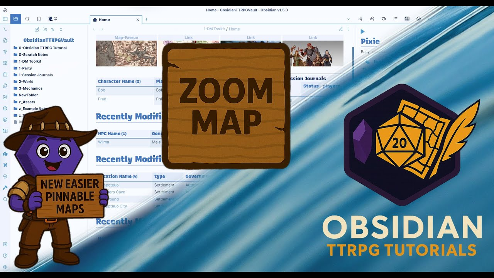

# Zoom Map (Obsidian Plugin)

Zoom Map lets you embed an image as an interactive, zoomable map inside Obsidian and place markers, stickers, drawings, measurements, HUD pins and (optionally) editable text layers on top.

Joshua Plunkett (obsidianttrpgtutorials.com) made a video about it. It’s a bit outdated, so I’d still recommend checking the README.
[](https://youtu.be/rB4MCgl44lU)

## Features

### Core map interaction
- Pan/zoom image (mouse wheel, double click, drag)
- Mobile gestures: pinch zoom, two-finger pan
- Optional pan clamping to image bounds (toggle in map context menu)
- Multiple maps per note (multiple `zoommap` code blocks)

### Marker system
- Add markers (Shift + click or context menu)
- Drag markers to move them
- Edit markers in a modal (icon, link, tooltip, zoom range, etc.)
- Delete markers via context menu
- Marker layers: visibility + lock toggles
- Optional: bind a marker layer to a specific base image

### Icons, stickers, swap pins
- Configurable icon library (data URLs or vault images)
- Per-map pin size overrides (“Pin sizes for this map…”)
- Stickers (image decals) with per-sticker size
- Swap pins: right click cycles through frames (icons/link per frame)
 - Access under collections

### Hover previews & tooltips
- Markers with a link show the native Obsidian hover popover
- Markers without a link can show an internal tooltip (stable, rendered inside the map)

### Image layers
- Multiple base images (switchable via context menu)
- Image overlays (toggleable via context menu)
- Overlay lazy loading for performance

### Ruler / measurement
- Measure distances by clicking points (multi-segment)
- Calibrate scale per base image
- Units: auto metric/imperial, m/km/mi/ft, and custom units
- Optional travel time presets (distance → time conversions)

### Drawing tools (Settings→Presets)
- Draw layers (visibility/lock)
- Draw shapes: rectangle, circle, polygon
- Pattern fills are stored as SVG files for reliability across restarts

### Text layers (Settings→Presets)
- Box-based text layers with drawn baselines
- Inline typing directly on the map (one input per baseline)
- Auto-flow between baselines (push overflow forward, pull words back)
- Optional angled baselines (Ctrl while drawing baseline)
- Lock text layers to prevent edits

### Render modes
- DOM (default)
- Canvas render mode for weaker devices (tablets/mobile)

### Storage
- Default: JSON marker file beside the image: `<image>.markers.json`
- Optional inline storage inside the note (`storage: note`)
- Writes are throttled and only saved when content actually changed

---

## Installation (manual)
- Create folder: <your-vault>/.obsidian/plugins/zoom-map
- Copy build output into that folder: manifest.json, main.js, styles.css
- Reload Obsidian → Settings → Community plugins → enable Zoom Map

---

## Usage

Simple Mode
- Use the command "Zoom Map: Insert new map...". You have to be in edit mode to insert a new map this way.
 - A modal opens and you can set up your image layers, overlay layers and so on.
 - On a map right click→Options→Edit view... brings you back to this setup.

Pro Mode (no benefits included)
Add a code block: 
~~~
```zoommap
image: Assets/Map.jpg
# markers is optional; defaults to <image>.markers.json
# markers: Assets/Map.jpg.markers.json

# Map view limits
minZoom: 0.3
maxZoom: 8

# Size & interactivity
height: 560px
width: 100%
resizable: true
resizeHandle: native     # left | right | both | native
render: canvas           # or: dom

# Responsive display (fit into width, no wheel/pinch/dblclick pan/zoom)
responsive: false        # true → always fit; disables pan/zoom gestures

# Storage (optional)
# storage: note          # default is json; use "note" to store markers inline
# id: map-1              # optional stable id for inline storage (per code block)

# Alignment / wrapping (optional)
align: right             # left | center | right
wrap: true               # wrap text; useful with left/right alignment
```
~~~

### Add markers
- **Shift + click** on the map  
  or
- **Right click** the map → “Add marker here”

### Edit / delete markers
- Right click a marker → edit/delete

---

## YAML options

### Required
- `image: string`  
  Path to the base image (vault path or link target)

### Optional map view
- width: 200px
- height: 200px
- minZoom: number | 150%  
- maxZoom: number | 300%
- render: dom | canvas
- resizable: true
- resizeHandle: native | left | right | both
- responsive: true #If true: map fits to width; zoom/pan gestures are disabled
- wrap: true 
- align: left|center|right
- storage: json | note
- id: string #(recommended if storage: note)

### Base images & overlays
imageBases:
  - path: Assets/BaseA.png
    name: Base A
  - path: Assets/BaseB.png
    name: Base B

imageOverlays:
  - path: Assets/overlay-roads.png
    name: Roads
    visible: true
  - path: Assets/overlay-labels.png
    name: Labels
    visible: false

### Scale / calibration
- scale:
  metersPerPixel: 0.25
or:
- scale:
   pixelsPerMeter: 4

---

## Viewport frame

You can render a transparent frame image *above* the map (e.g. RPG UI frames).
The map viewport is defined by **4-sided insets**, which scale with the frame.

- viewportFrame: Assets/frame.png
- viewportFrameInsets:
  unit: framePx     # framePx | percent
  top: 140
  right: 110
  bottom: 170
  left: 110

### Notes
- framePx is recommended:
  - values are measured in the frame image’s original pixel space
  - they automatically scale correctly when resizing

---

## Settings overview

### Preferences (global)
- Enable drawing tools
- Enable text layers
- Pins: “scale like sticker” by default
- Prefer first visible unlocked marker layer for new markers

### Icon library
- Add/edit icons (key, path/data URL, size, anchor X/Y, rotation)
- SVG icon picker (SVG Folder)
 - Use your own or download Font Awesome or rpg awesome SVG's library.
 - Unzip the SVG library from Font or RPG Awesome
 - If you don't find your SVG's maybe then the folder path is too long.
- Optional SVG outline tool (adds a stroke layer inside SVG)

### Collections (base-bound)
Collections define which pins/favorites/stickers/swap pins appear in the map context menu,
depending on the active base image.

### Ruler
- Line color + width
- Custom units
- Travel time presets

---

## Marker JSON format (high level)

Marker files are stored as `<image>.markers.json` and include:
- `bases`, `overlays`, `activeBase`
- `layers`, `markers`
- `measurement` (scale per base)
- `pinSizeOverrides`
- `drawLayers`, `drawings`
- `textLayers`

---

## Development

```bash
npm install
npm run dev    # watch build
npm run build  # production build
```

---

## License
MIT
```